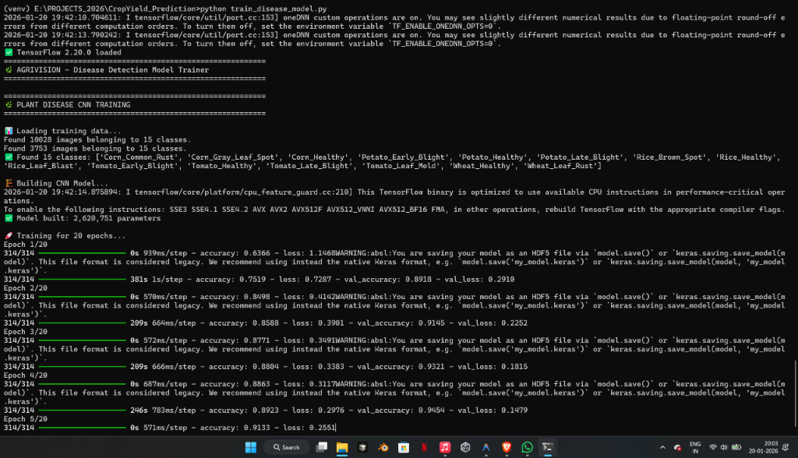

# 🧠 How the Plant Disease CNN Model is Trained

This document explains the complete training process of our MobileNetV2-based Convolutional Neural Network (CNN) for plant disease detection.

---

## 📊 Training Output Explained



When you run `python train_disease_model.py`, you see output like this:

```
Epoch 3/20
314/314 ━━━━━━━━━━━━━━━━━━━━ 209s 666ms/step - accuracy: 0.8804 - loss: 0.3383 - val_accuracy: 0.9321 - val_loss: 0.1815
```

Let's break down what each part means:

| Term | Meaning |
|------|---------|
| **Epoch 3/20** | The model is on its 3rd complete pass through all training images (out of 20 total) |
| **314/314** | 314 batches of images have been processed in this epoch |
| **209s** | This epoch took 209 seconds (about 3.5 minutes) |
| **666ms/step** | Each batch took ~666 milliseconds to process |
| **accuracy: 0.8804** | The model correctly classified 88% of training images |
| **loss: 0.3383** | How "wrong" the model's predictions were (lower is better) |
| **val_accuracy: 0.9321** | 93.2% accuracy on validation images (unseen during training) |
| **val_loss: 0.1815** | Validation loss (this is the most important metric!) |

---

## 🔄 What is an Epoch?

An **epoch** is one complete pass through the entire training dataset.

```
┌─────────────────────────────────────────────────────────────┐
│                        EPOCH 1                              │
│  ┌─────┐ ┌─────┐ ┌─────┐ ┌─────┐ ┌─────┐      ┌─────┐      │
│  │Batch│→│Batch│→│Batch│→│Batch│→│Batch│→ ... │Batch│      │
│  │  1  │ │  2  │ │  3  │ │  4  │ │  5  │      │ 314 │      │
│  └─────┘ └─────┘ └─────┘ └─────┘ └─────┘      └─────┘      │
│                    ↓ Model learns after each batch          │
└─────────────────────────────────────────────────────────────┘
                              ↓
┌─────────────────────────────────────────────────────────────┐
│                        EPOCH 2                              │
│         Same images, but model is now smarter!              │
└─────────────────────────────────────────────────────────────┘
                              ↓
                            ...
                              ↓
┌─────────────────────────────────────────────────────────────┐
│                       EPOCH 20                              │
│              Model has seen everything 20 times             │
└─────────────────────────────────────────────────────────────┘
```

### Why Multiple Epochs?

Imagine learning to identify diseases by looking at flash cards:
- **Epoch 1**: You see all 10,000 leaf images once. You're still confused.
- **Epoch 5**: You've seen them 5 times. Patterns start emerging.
- **Epoch 20**: You've mastered the common patterns and can generalize.

---

## 📦 What is a Batch?

A **batch** is a small group of images processed together.

In our training:
- **Total Training Images**: 10,028
- **Batch Size**: 32 images
- **Batches per Epoch**: 10,028 ÷ 32 ≈ 314 batches

### Why Use Batches?

1. **Memory Efficiency**: Loading all 10,000 images at once would crash your computer
2. **Faster Learning**: The model updates its weights after each batch, not after seeing all images
3. **Better Generalization**: Random batches add noise that helps the model learn robust patterns

---

## 📉 What is Loss?

**Loss** measures how wrong the model's predictions are. It's a number calculated by comparing:
- What the model predicted (e.g., "70% confident this is Early Blight")
- What the correct answer is (e.g., "This IS Early Blight")

```
                    Model Prediction
                          ↓
    ┌──────────────────────────────────────┐
    │  Tomato_Early_Blight: 0.70 (70%)     │ ← Predicted
    │  Tomato_Late_Blight:  0.15 (15%)     │
    │  Tomato_Healthy:      0.10 (10%)     │
    │  Others:              0.05 (5%)      │
    └──────────────────────────────────────┘
                          ↓
              Actual Label: Tomato_Early_Blight
                          ↓
    Loss = -log(0.70) = 0.357 (Categorical Cross-Entropy)
```

### Loss Trends

| Loss Value | What It Means |
|------------|---------------|
| > 2.0 | Model is guessing randomly (bad) |
| 1.0 - 2.0 | Model is learning basic patterns |
| 0.3 - 1.0 | Model is getting good |
| < 0.3 | Model is well-trained (great!) |

**Goal**: Minimize loss, especially `val_loss` (validation loss).

---

## 📈 What is Accuracy?

**Accuracy** = (Correct Predictions / Total Predictions) × 100%

```
Example with 100 images:
- Model correctly identified 88 images
- Accuracy = 88/100 = 88% = 0.88
```

### Training vs Validation Accuracy

| Metric | What It Uses | What It Tells Us |
|--------|--------------|------------------|
| `accuracy` | Training images (80%) | How well the model memorizes training data |
| `val_accuracy` | Validation images (20%) | How well the model generalizes to NEW images |

> ⚠️ **Important**: If `accuracy` is 99% but `val_accuracy` is 60%, the model is **overfitting** (memorizing instead of learning).

---

## 🏗️ Our Model Architecture

We use **Transfer Learning** with **MobileNetV2**.

### What is Transfer Learning?

Instead of training from scratch, we use a model that already learned to recognize shapes, edges, and textures from millions of images (ImageNet dataset).

```
┌─────────────────────────────────────────────────────────────┐
│                    MobileNetV2 (Pre-trained)                │
│  ┌─────────┐   ┌─────────┐   ┌─────────┐   ┌─────────┐      │
│  │ Layer 1 │ → │ Layer 2 │ → │  ...    │ → │Layer 155│      │
│  │ (Edges) │   │(Textures)│   │         │   │(Features)│    │
│  └─────────┘   └─────────┘   └─────────┘   └─────────┘      │
│       ↑                                                     │
│   FROZEN (We don't change these - they're already smart)    │
└─────────────────────────────────────────────────────────────┘
                              ↓
┌─────────────────────────────────────────────────────────────┐
│                 Our Custom Layers (Trainable)               │
│  ┌─────────────────┐   ┌─────────────────┐   ┌───────────┐  │
│  │ GlobalAvgPool2D │ → │ Dense(256, ReLU)│ → │ Dropout   │  │
│  └─────────────────┘   └─────────────────┘   │   (0.5)   │  │
│                                              └───────────┘  │
│           ↓                                                 │
│  ┌─────────────────┐   ┌──────────────────┐                 │
│  │ Dense(128, ReLU)│ → │ Dense(15,Softmax)│ → Predictions   │
│  └─────────────────┘   └──────────────────┘                 │
│       ↑                                                     │
│   TRAINABLE (These layers learn plant diseases)             │
└─────────────────────────────────────────────────────────────┘
```

### Model Parameters

From your output: `✅ Model built: 2,620,751 parameters`

- **MobileNetV2 (frozen)**: ~2.3 million parameters (not trained)
- **Our custom layers**: ~320,000 parameters (trained)

This is much more efficient than training 2.6M parameters from scratch!

---

## 📂 Training vs Validation Split

Your dataset is split into two parts:

```
┌─────────────────────────────────────────────────────────────┐
│                   Total Dataset (13,781 images)             │
│  ┌───────────────────────────────┐ ┌───────────────────────┐│
│  │     Training Set (80%)        │ │  Validation Set (20%) ││
│  │       10,028 images           │ │     3,753 images      ││
│  │                               │ │                       ││
│  │  Used to TEACH the model      │ │ Used to TEST the model││
│  │  Model sees these repeatedly  │ │ Model never trains on ││
│  │                               │ │ these - only predicts ││
│  └───────────────────────────────┘ └───────────────────────┘│
└─────────────────────────────────────────────────────────────┘
```

---

## 🔧 Data Augmentation

To make the model more robust, we apply random transformations to training images:

| Augmentation | What It Does | Why It Helps |
|--------------|--------------|--------------|
| `rotation_range=20` | Rotates image ±20° | Leaves can be photographed at any angle |
| `width_shift_range=0.2` | Shifts image left/right | Leaf might not be centered |
| `height_shift_range=0.2` | Shifts image up/down | Same as above |
| `horizontal_flip=True` | Mirrors image | Diseases look the same flipped |
| `zoom_range=0.2` | Zooms in/out | Photos taken from different distances |

```
Original Image → [Random Transform] → Augmented Image
     🍃       →    Rotate 15°      →      🍃↻
     🍃       →    Flip Horizontal →      ↔🍃
     🍃       →    Zoom 110%       →      🍃🔍
```

This makes the model see "new" images every epoch, even though we have the same 10,028 photos!

---

## 🛑 Early Stopping & Model Checkpoints

### Early Stopping

If `val_accuracy` doesn't improve for 5 epochs, training stops early:

```python
EarlyStopping(patience=5, restore_best_weights=True, monitor='val_accuracy')
```

This prevents:
- Wasting time on pointless training
- Overfitting (model memorizing instead of learning)

### Model Checkpoint

After every epoch, if `val_accuracy` improves, the model is saved:

```python
ModelCheckpoint('models/disease_model.h5', save_best_only=True, monitor='val_accuracy')
```

This ensures you always have the BEST model, even if later epochs get worse.

---

## 📊 Interpreting Your Training Progress

Based on your output, the training is going excellently:

| Epoch | val_accuracy | Status |
|-------|--------------|--------|
| 1 | 89.18% | Good start! |
| 2 | 91.45% | Improving (+2.27%) |
| 3 | 93.21% | Excellent (+1.76%) |
| 4 | 94.54% | Very good (+1.33%) |
| 5 | Training... | Expected ~95%+ |

### Signs of Good Training

✅ `val_accuracy` is increasing  
✅ `val_loss` is decreasing  
✅ Training and validation metrics are close (not overfitting)  
✅ Model is being saved (you saw the HDF5 warning)

---

## 📁 Output Files

After training completes, you'll have:

```
models/
├── disease_model.h5    # The trained CNN model (~10-15 MB)
└── classes.json        # Maps index to class name
```

The `classes.json` file ensures your app knows that:
- Index 0 = "Corn_Common_Rust"
- Index 1 = "Corn_Gray_Leaf_Spot"
- ... etc.

---

## 🚀 What Happens After Training?

1. **Model Saved**: `disease_model.h5` is saved to `models/`
2. **App Loads Model**: When you run `app.py`, it loads this trained model
3. **User Uploads Image**: The image is preprocessed (resized to 224x224, normalized)
4. **Prediction Made**: Model outputs 15 probabilities (one for each disease)
5. **Result Displayed**: Highest probability is shown as the diagnosis

---

## 📚 Glossary

| Term | Definition |
|------|------------|
| **CNN** | Convolutional Neural Network - specialized for image recognition |
| **Epoch** | One complete pass through all training data |
| **Batch** | Small group of images processed together |
| **Loss** | Measure of how wrong predictions are |
| **Accuracy** | Percentage of correct predictions |
| **Overfitting** | Model memorizes training data but fails on new data |
| **Transfer Learning** | Using a pre-trained model as a starting point |
| **Validation Set** | Images used to test model performance (not used for training) |
| **MobileNetV2** | Efficient CNN architecture by Google, optimized for mobile devices |

---

**📌 Pro Tip**: If you want even better accuracy, try:
- Using the larger 2.18 GB dataset
- Increasing epochs to 30-50
- Fine-tuning (unfreezing) some MobileNetV2 layers after initial training
